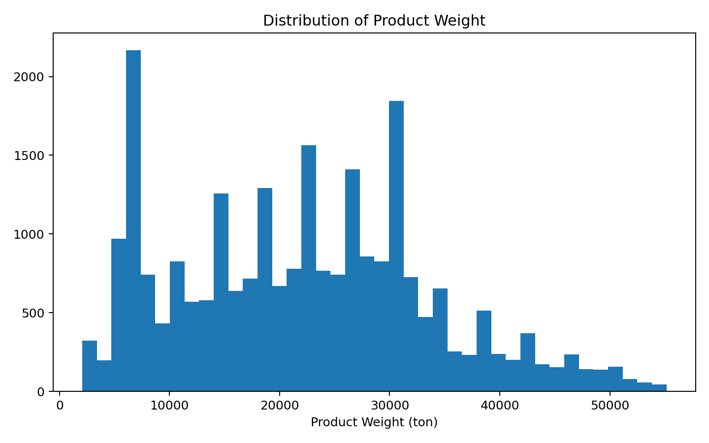
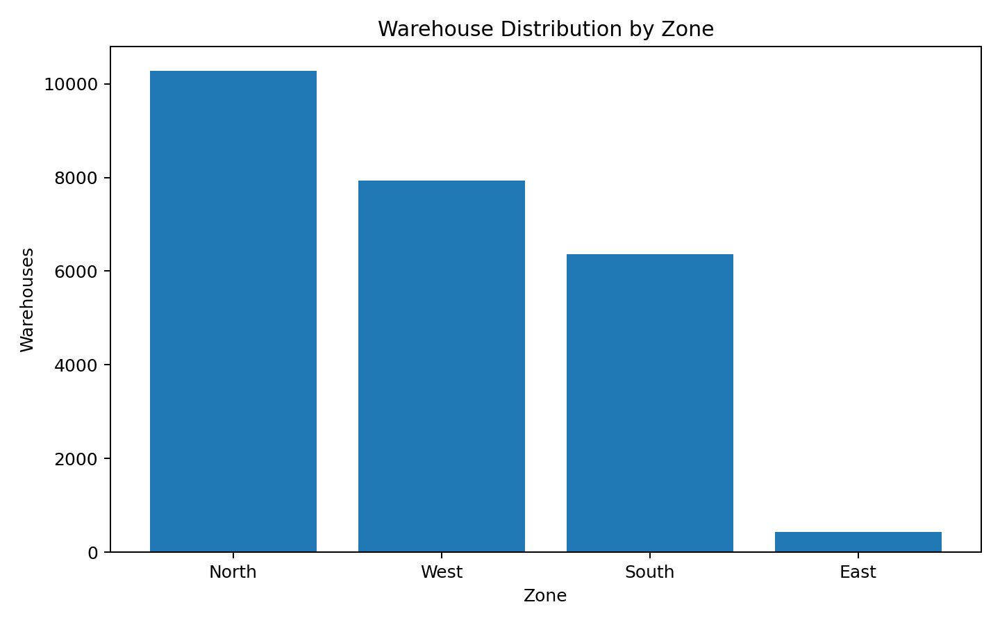
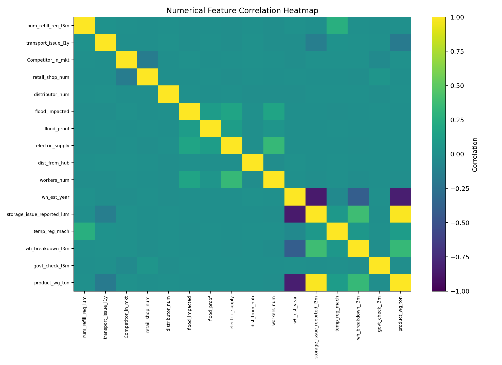
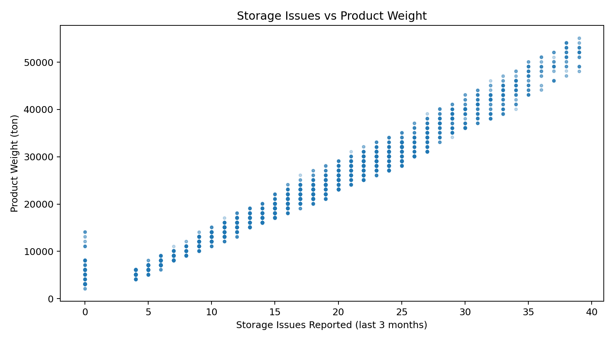
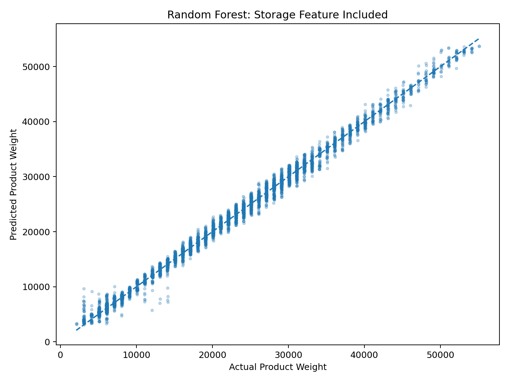
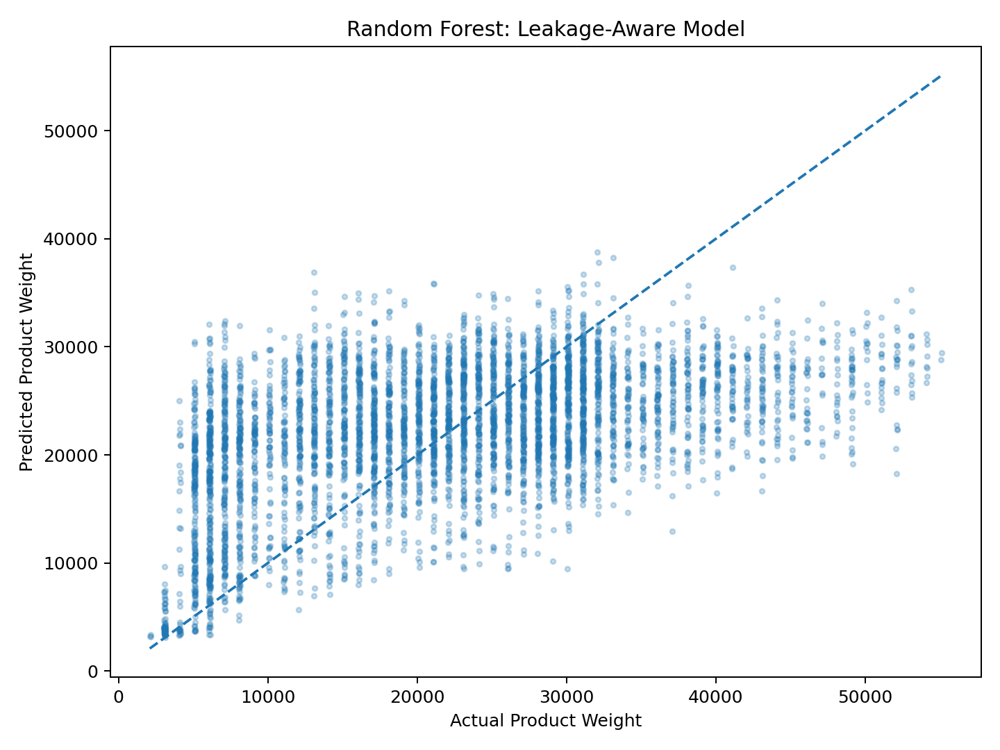

# FMCG Supply Chain Analytics

### Warehouse-Level Product Weight Prediction

[](https://www.python.org/) [](https://pandas.pydata.org/) [](https://scikit-learn.org/) [](https://jupyter.org/)

## Overview

This project analyzes warehouse-level operational data from an instant noodles FMCG supply network. The objective is to understand the relationship between warehouse characteristics and **product weight handled (`product_wg_ton`)**, and to evaluate regression models for warehouse-level prediction.

The project combines data-quality assessment, exploratory data analysis, preprocessing, regression modeling, model comparison, and a dedicated feature-validity/leakage check.

## Business Problem

FMCG warehouse networks differ in capacity, location, distribution reach, infrastructure, and operational conditions. Understanding which variables are associated with product movement can support supply-planning analysis and help identify variables that deserve further operational investigation.

**Core question:** Can warehouse-level characteristics be used to predict the amount of product handled by a warehouse?

## Dataset

The supplied dataset contains **25,000 observations and 24 columns**. Key feature groups include:

| Group | Examples |
|---|---|
| Warehouse | capacity, location type, ownership |
| Network | zone, regional zone, distance from hub |
| Distribution | retail shops, distributors, refill requests |
| Operations | transport issues, storage issues, breakdowns |
| Infrastructure | electricity, temperature regulation |
| Risk | flood impact, flood-proof status |
| Compliance | government certificate, government checks |
| Target | `product_wg_ton` |

The raw CSV is included in the working project package for reproducibility, but **verify that you have permission to redistribute the challenge dataset before pushing it to a public GitHub repository**. The repository `.gitignore` is configured to prevent accidental CSV commits.

## Workflow

```text
Raw Dataset
    ↓
Data Quality Assessment
    ↓
Missing-Value Treatment
    ↓
Exploratory Data Analysis
    ↓
Feature Validity / Leakage Check
    ↓
Preprocessing Pipeline
    ↓
Linear Regression Baseline
    ↓
Random Forest Regression
    ↓
Leakage-Aware Model
    ↓
Model Comparison & Business Interpretation
```

## Exploratory Analysis

Selected visuals are available under [`reports/figures`](reports/figures/).

### Product-weight distribution



### Warehouse distribution by zone



### Numerical feature correlations



## Important Modeling Finding: Feature Validity

The supplied data contains an unusually strong Pearson correlation between `storage_issue_reported_l3m` and `product_wg_ton`: approximately **0.987**.



This is important because a very strong predictor can create **data leakage or overly optimistic performance** if the variable is generated after the prediction point, is derived from the target, or otherwise would not be available when the prediction is made. Correlation alone does not establish causation.

For that reason, the notebook reports two views:

1. **Storage-inclusive model** — uses the supplied operational features, including `storage_issue_reported_l3m`.
2. **Leakage-aware model** — removes `storage_issue_reported_l3m` to measure how much predictive power remains without the suspicious feature.

## Model Results

Using an 80/20 train-test split with `random_state=42` and the preprocessing pipeline implemented in the notebook:

| Model | MAE | MSE | R² |
|---|---:|---:|---:|
| Linear Regression | 1,010.79 | 1,919,209.19 | 0.9857 |
| Random Forest — storage included | 691.94 | 865,371.64 | 0.9935 |
| Random Forest — storage excluded | 8,075.17 | 101,751,629.70 | 0.2395 |

These results show that the storage feature accounts for a very large share of the model's predictive signal. The high score of the storage-inclusive model should therefore **not** be presented as evidence of production-ready forecasting accuracy.

### Actual vs predicted





## Key Takeaways

- The dataset provides substantial warehouse-level operational information for supply-chain analysis.
- `storage_issue_reported_l3m` has an exceptionally strong relationship with the target and requires business validation before being treated as a legitimate predictive feature.
- Random Forest outperformed the Linear Regression baseline on the current test split when the storage feature was included.
- Removing the storage feature causes a large performance decline, showing that the current dataset contains limited predictive signal beyond that variable.
- The next step toward a genuine supply-planning solution is to define a prediction timestamp and use only variables available before that point.

## Future Extensions

- Time-aware demand forecasting
- Safety-stock and reorder-point optimization
- Warehouse capacity constraints
- Transportation-cost modeling
- Network optimization using linear/integer programming
- Scenario and sensitivity analysis
- SHAP-based model explainability
- Power BI decision-support dashboard

## Repository Structure

```text
fmcg-supply-chain-analytics/
├── README.md
├── LICENSE
├── requirements.txt
├── .gitignore
├── data/
│   ├── FMCG_data.csv
│   └── README.md
├── notebooks/
│   └── FMCG_Supply_Chain_Analysis.ipynb
└── reports/
    └── figures/
        ├── actual_vs_predicted_with_storage.png
        ├── actual_vs_predicted_without_storage.png
        ├── correlation_heatmap.png
        ├── product_weight_distribution.png
        ├── storage_issue_vs_product_weight.png
        └── warehouse_distribution_by_zone.png
```

## Getting Started

```bash
git clone https://github.com/<your-username>/fmcg-supply-chain-analytics.git
cd fmcg-supply-chain-analytics
python -m venv .venv
.venv\Scripts\activate
pip install -r requirements.txt
jupyter notebook
```

Open `notebooks/FMCG_Supply_Chain_Analysis.ipynb`.

## License

The code in this repository is provided under the MIT License. The dataset may be subject to separate ownership or challenge terms; see `data/README.md` before redistributing it.
